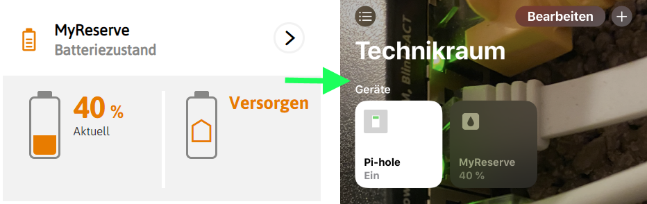
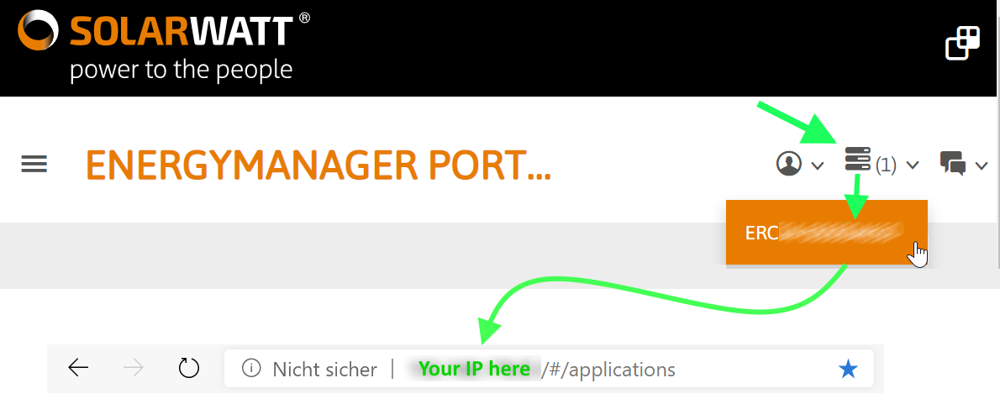

# Homebridge Kiwigrid Plugin

This plugin brings the battery level of your Kiwigrid powered PV battery to HomeKit.

## WTH is Kiwigrid?

[Kiwigrid](https://www.kiwigrid.com/) is a german Smart Metering platform you might already be using with your PV plant.

If you are using a PV battery from [SOLARWATT](https://www.solarwatt.de/) like I do and you are used to check your stats on [their EnergyManager portal](https://desktop.energymanager.com/), you're ready to go.

Other battery manufacturers might also be supported. In lack of a basement full of PV batteries I could just not test others.

## Finding your local API gateway
To use this Homebridge plugin, you need to know the IP address of your local API gateway sending your data to Kiwigrid. 
> This device has to be located on the same local network as your homebridge host

Scan your local network to find this device. If you find possible candidates, try them with this URL:

    http://IPADDRESS/rest/kiwigrid/wizard/devices

You should get a tiny JSON response immediately. If you do, congratulations, this is you local API gateway.

If you are using SOLARWATT's EnergyManager, you can find the local IP address easily.
Just head over to [the portal](https://desktop.energymanager.com/), login and click on the highlighted menu:

